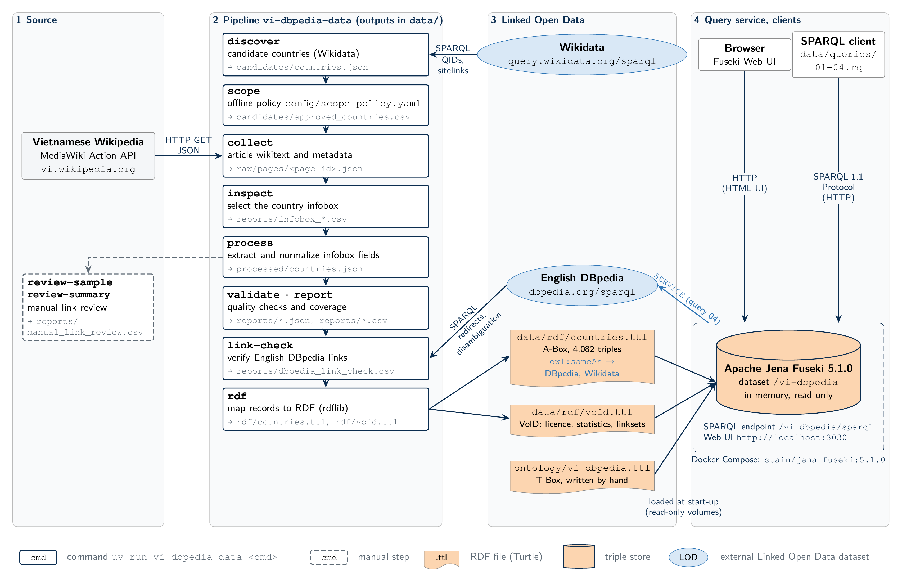
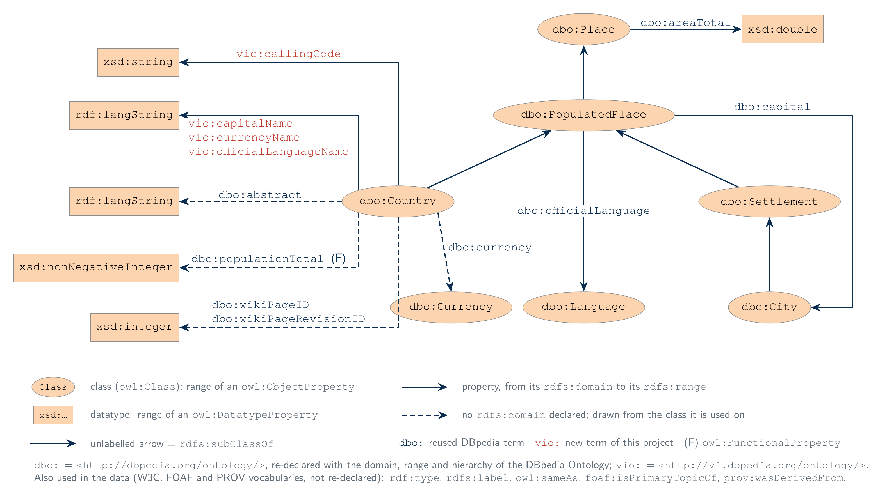
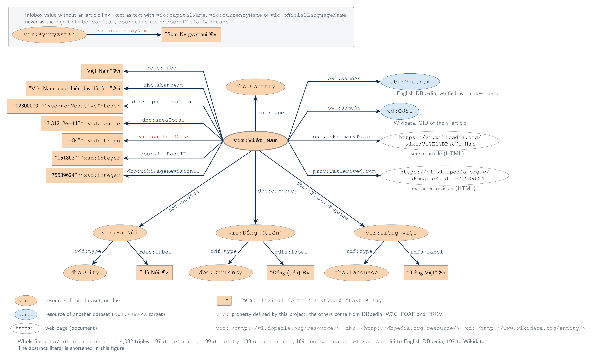

# Capstone Project Report
**Project Title:** Build a DBpedia Version for the Vietnamese Language
**Domain Scope:** Countries and Sovereign States

---

## 1. Executive Summary

This project successfully constructs a Vietnamese-language equivalent of DBpedia for the domain of countries. By systematically scraping and processing semi-structured Vietnamese Wikipedia infoboxes, the project has generated a Semantic Web-compliant, 5-star Linked Open Data (LOD) Knowledge Graph. The final dataset encompasses 197 countries, modeled using the standard DBpedia ontology, linked to the global English DBpedia dataset, and hosted on a locally deployable SPARQL endpoint using Apache Jena Fuseki.

## 2. Introduction

### 2.1. Background
DBpedia is a crowd-sourced community effort to extract structured information from Wikipedia and make it available on the Semantic Web. While the English DBpedia is incredibly comprehensive, localized versions are crucial for cross-lingual NLP, regional knowledge graphs, and localized semantic search.

### 2.2. Project Objectives
As per the official capstone brief, this project set out to achieve five core objectives:
1. **Define an ontology** representing the collected information and its relationships.
2. **Collect Vietnamese Wikipedia articles** as the primary data source.
3. **Transform the data into the 4-star standard** (using W3C standards like RDF).
4. **Establish links to English DBpedia** to interconnect the Vietnamese dataset with the global LOD cloud.
5. **Provide a query interface** to allow users to interact with the semantic data.

## 3. System Architecture and Design

The system is designed as an end-to-end data pipeline, split into a Python-based extraction/transformation toolset and a Dockerized hosting environment. Figure 1 shows the four layers: the data sources, the eight pipeline commands with the file each one writes, the published Turtle files, and the Fuseki query service with its clients.



*Figure 1. Service architecture. The pipeline reads Vietnamese Wikipedia (MediaWiki API), uses Wikidata only to discover candidate countries, and checks English DBpedia links with `link-check`. The Turtle files are loaded into an in-memory, read-only Apache Jena Fuseki dataset, which answers SPARQL 1.1 queries and can federate to DBpedia with `SERVICE`.*

### 3.1. Data Collection Pipeline (Web Scraping)
The data extraction is orchestrated via a bespoke CLI tool (`vi-dbpedia-data`). It queries the Wikidata API to discover all existing entities classified as countries, subsequently mapping them to their localized Vietnamese Wikipedia counterparts. The raw Wikitext is then extracted using the MediaWiki API.

### 3.2. Ontology and Schema Design
Following Linked Open Data best practices, the project avoided inventing redundant vocabularies and instead reused the **DBpedia Ontology (`dbo:`)** and W3C standard vocabularies (`rdfs:`, `owl:`, `foaf:`, `prov:`). The ontology file `ontology/vi-dbpedia.ttl` declares every term used, with the DBpedia domain/range and Vietnamese labels, and defines new `vio:` terms only where DBpedia has none (`vio:callingCode`, and text fallbacks such as `vio:capitalName` for unlinked infobox values).

*   **Namespace (`vir:`):** `http://vi.dbpedia.org/resource/` is used for all canonical entities (e.g., `vir:Việt_Nam`).
*   **Classes:** `dbo:Country` for countries; linked capitals, currencies and languages are typed `dbo:City`, `dbo:Currency` and `dbo:Language`.
*   **Properties:** Mapped standard demographic data to strictly-typed RDF properties.
    *   `title_vi` → `rdfs:label` (Literal with `@vi` language tag)
    *   `population_total` → `dbo:populationTotal` (Typed as `xsd:nonNegativeInteger`, the DBpedia range)
    *   `area_km2` → `dbo:areaTotal` (Typed as `xsd:double`, in m²)
    *   `capital` → `dbo:capital` (Object property linking to a new URI, e.g., `vir:Hà_Nội`)

Figure 2 shows the ontology (T-Box) declared in `ontology/vi-dbpedia.ttl`: the reused DBpedia classes with their class hierarchy, and each property drawn from its `rdfs:domain` to its `rdfs:range`.



*Figure 2. Ontology (T-Box). Ellipses are classes and rectangles are datatypes; unlabelled arrows are `rdfs:subClassOf`. Dashed arrows are properties without an `rdfs:domain` in the DBpedia Ontology, drawn from the class they are used on. Terms in red are the new `vio:` terms.*

Figure 3 shows how one country record is stored (A-Box): every triple of `vir:Việt_Nam` in `data/rdf/countries.ttl`, with the exact literal forms of the file.



*Figure 3. Data schema (A-Box) for one country. Ellipses are resources and rectangles are literals. Blue ellipses are resources of other datasets, linked with `owl:sameAs` (the 5th star). Linked capitals, currencies and languages are typed by the range of the property that links to them. The inset shows how an infobox value without an article link is stored.*

## 4. Implementation and Fulfillment of Requirements

### 4.1. Transforming to the 4-Star Standard (Req 3)
To achieve the 4-star Linked Data classification, data must be structured in a non-proprietary format using open W3C standards like RDF.
*   **Implementation:** The Python `rdflib` library is used to transform the cleaned JSON extracts into a directed RDF graph. The data is serialized into the **Turtle (`.ttl`)** format, outputting strictly typed literals and well-formed URIs rather than strings. A VoID description (`data/rdf/void.ttl`) states the open licence (CC BY-SA 4.0, inherited from Wikipedia), source and dataset statistics.

### 4.2. Establishing Links to English DBpedia (Req 4)
Fulfilling this requirement officially pushes the dataset into the **5-Star Open Data** tier, as it provides context by linking to other people's data.
*   **Implementation:** The English DBpedia candidate is derived from the Vietnamese article's English **interlanguage link**, a structural link maintained by Wikipedia editors. The `link-check` command then verifies each candidate against the DBpedia SPARQL endpoint: DBpedia redirects are replaced by their target (`Timor-Leste` → `East_Timor`), and disambiguation pages or missing resources are not linked (`Palestine`). The script then generates an `owl:sameAs` triple (e.g., `vir:Việt_Nam owl:sameAs <http://dbpedia.org/resource/Vietnam>`). Each country is also linked to its Wikidata item (`owl:sameAs wd:Q881`), using the QID of the Vietnamese article itself.

### 4.3. Providing a Query Interface (Req 5)
*   **Implementation:** A `docker-compose.yml` file is provided to orchestrate an instance of **Apache Jena Fuseki** (`stain/jena-fuseki:5.1.0`). The ontology, `countries.ttl` and `void.ttl` are mounted into the container as read-only volumes and loaded into one dataset. Four saved queries are provided in `data/queries/`, including a federated query that follows `owl:sameAs` into the live English DBpedia endpoint. This provides a robust, industry-standard SPARQL endpoint at `http://localhost:3030/vi-dbpedia`, complete with a web GUI for end-users to execute relational graph queries.

## 5. Project Structure

The repository is modularly structured to separate the pipeline logic from the generated artifacts:

```text
vn-dpedia-country/
├── src/vi_dbpedia_data/       # Python source code for the extraction pipeline
│   ├── cli.py                 # Command Line Interface routing
│   ├── collect.py             # MediaWiki API fetching
│   ├── extract.py             # Wikitext to JSON parser
│   └── rdf.py                 # JSON to RDF/Turtle Transformer (rdflib)
├── data/
│   ├── raw/                   # Raw downloaded Wikipedia wikitext files
│   ├── processed/             # Cleaned JSON infobox data
│   ├── rdf/                   # Final output: countries.ttl (The Semantic Graph)
│   └── queries/               # Sample SPARQL queries for evaluation
├── docs/                      # Extensive documentation (Ontology, Pipeline setup)
├── pyproject.toml             # Modern Python dependency management (uv)
└── docker-compose.yml         # Container configuration for Apache Jena Fuseki
```

## 6. Achievements and Results

1.  **High-Fidelity Extraction:** Successfully harvested and processed 197 sovereign state records from Vietnamese Wikipedia.
2.  **Semantic Graph Generation:** Synthesized an RDF graph of **4,082 triples** describing **704 typed entities** (197 countries, 199 cities, 139 currencies, 169 languages).
3.  **Cross-Lingual Identity:** Established verified `owl:sameAs` links to English DBpedia for **196 of 197** countries (195 verified, 1 redirect resolved; 1 disambiguation page left unlinked) and to Wikidata for all 197, allowing queries to traverse between the Vietnamese dataset and the LOD cloud.
4.  **Operational Web Service:** Deployed a fully functional SPARQL endpoint that can instantaneously process complex mathematical, string, and relational graph queries (e.g., "Find all countries using the Euro with a population over 10 million").

## 7. Conclusion

This capstone project successfully demonstrates the entire lifecycle of Semantic Web data engineering. By bridging the gap between semi-structured regional Wikitext and a formalized, 5-star Linked Open Data graph, the project fulfills all mandated requirements. The resulting localized DBpedia slice serves as a foundational prototype that can be readily scaled horizontally to encompass broader domains (e.g., Cities, People, Organizations) in the Vietnamese language space.

