# Ontology and Schema Design

This document outlines the design mindset, rulesets, and analysis used to model the Vietnamese DBpedia Country dataset into a structured RDF Knowledge Graph. The ontology itself is the Turtle file [`ontology/vi-dbpedia.ttl`](../ontology/vi-dbpedia.ttl).

## 1. Basic Analysis

The source data originates from Vietnamese Wikipedia infoboxes. Wikipedia data is notoriously semi-structured and inconsistent. For countries, the data extraction pipeline yields a canonical set of fields:
- **Identifiers:** Page ID, Revision ID, Canonical Title, Source URL, Wikidata ID, English Title.
- **Textual Data:** Abstract (summary paragraph).
- **Quantitative Data:** Population Total, Area (km²).
- **Categorical/Relational Data:** Capital, Currencies, Official Languages, Calling Codes.

In a traditional relational database, we would create a `countries` table with foreign keys to `capitals` and `currencies`. To meet the **Semantic Web 4-star/5-star standards**, we instead model this as a directed graph where entities are nodes connected by relationship edges (predicates).

## 2. Design Mindset

1. **Reusability over Invention:** We reuse the **DBpedia Ontology (`dbo:`)** and W3C vocabularies (`rdfs:`, `owl:`, `foaf:`, `prov:`) wherever their meaning matches, so the data can be queried with the same terms as English DBpedia.
2. **Declared, not assumed (MIREOT):** Every class and property used in the data is declared in `ontology/vi-dbpedia.ttl`. Reused DBpedia terms are re-declared with the domain, range and class hierarchy **copied from the DBpedia Ontology** (checked against `https://dbpedia.org/sparql`) and given Vietnamese labels, following the MIREOT principle (minimum information to reference an external ontology term) instead of importing the whole DBpedia Ontology. A test (`tests/test_rdf.py`) fails if the data uses a term the ontology does not declare.
3. **New terms only when needed:** The project namespace `vio:` (`http://vi.dbpedia.org/ontology/`) holds only terms DBpedia lacks (Section 3.4).
4. **Open World Assumption:** The absence of a triple means "unknown", not "false". If a value could not be parsed, the triple is omitted; we never emit "null" or "N/A" strings.
5. **Things, not Strings:** Categorical values (capitals, currencies, languages) are resources (URIs) whenever the infobox links to an article.

## 3. Ruleset and Conventions

### 3.1. Namespaces and IRI Policy

| Prefix | Namespace | Use |
| :--- | :--- | :--- |
| `vir:` | `http://vi.dbpedia.org/resource/` | Resources (countries, cities, currencies, languages) |
| `vio:` | `http://vi.dbpedia.org/ontology/` | New ontology terms of this project |
| `viv:` | `http://vi.dbpedia.org/void/` | VoID dataset and linkset descriptions |
| `dbo:` | `http://dbpedia.org/ontology/` | Reused DBpedia Ontology terms |
| `dbr:` | `http://dbpedia.org/resource/` | English DBpedia resources (link targets) |
| `wd:` | `http://www.wikidata.org/entity/` | Wikidata items (link targets) |

- **Resource IRIs follow DBpedia:** the local name is the Wikipedia page title with spaces as underscores, the first letter upper-cased (MediaWiki treats it as case-insensitive) and Unicode kept, e.g. `vir:Việt_Nam`. Only IRI-unsafe characters (`"#%<>?[\]^`{|}`) are percent-encoded. Hence `tiếng Pháp`, `Tiếng Pháp` and `Tiếng_Pháp` are one resource.
- English DBpedia IRIs use the same rule (`dbr:São_Tomé_and_Príncipe`). DBpedia treats the percent-encoded form `S%C3%A3o_Tom%C3%A9…` as a **different** resource that has none of the article's data.

### 3.2. Class Definitions

| Class | Instances | Hierarchy (from DBpedia) |
| :--- | :--- | :--- |
| `dbo:Country` | The 197 country records | `dbo:Country ⊑ dbo:PopulatedPlace ⊑ dbo:Place` |
| `dbo:City` | Linked capitals | `dbo:City ⊑ dbo:Settlement ⊑ dbo:PopulatedPlace` |
| `dbo:Currency` | Linked currencies | — |
| `dbo:Language` | Linked official languages | — |

A linked capital, currency or language is typed by the **DBpedia range** of the property that links to it (`dbo:capital` → `dbo:City`, `dbo:currency` → `dbo:Currency`, `dbo:officialLanguage` → `dbo:Language`). This is the type an RDFS reasoner would infer anyway, stated explicitly so that queries by class work without a reasoner. Each such resource gets a single `rdfs:label`: its page title, as in DBpedia, not the link text, which varies between articles.

### 3.3. Property Mapping and Data Typing

| Extracted Field | RDF Predicate | Object Type / Datatype | Rule / Mindset |
| :--- | :--- | :--- | :--- |
| `title_vi` | `rdfs:label` | `Literal (@vi)` | Language tags (`@vi`) are crucial for internationalized data. |
| `abstract_vi` | `dbo:abstract` | `rdf:langString (@vi)` | Human-readable context. |
| `source_url` | `foaf:isPrimaryTopicOf` | `URIRef` | Connects the entity to the human-readable Wikipedia page. |
| `page_id` | `dbo:wikiPageID` | `xsd:integer` | As in DBpedia. |
| `revision_id` | `dbo:wikiPageRevisionID` | `xsd:integer` | As in DBpedia. |
| `revision_id` | `prov:wasDerivedFrom` | `URIRef` (`…/w/index.php?oldid=…`) | The exact revision the values were extracted from. |
| `population_total` | `dbo:populationTotal` | `xsd:nonNegativeInteger` | The DBpedia range; numeric, so `FILTER(?pop > 1000)` works. |
| `area_km2` | `dbo:areaTotal` | `xsd:double` | Converted from km² to m², the DBpedia unit convention. |
| `calling_codes` | `vio:callingCode` | `xsd:string` | New term, see Section 3.4. |
| `wikidata_id` | `owl:sameAs` | `wd:Q…` | See Section 3.5. |
| `english_title` | `owl:sameAs` | `dbr:…` | See Section 3.5. |

### 3.4. Relational Links and New Terms (`vio:`)

For `capital`, `currencies` and `official_languages`, the pipeline extracts a display label and an optional Wikipedia link target (`wiki_title`).

- **Rule:** If a `wiki_title` is present, emit the DBpedia **object property** to the resource of that page.
  ```turtle
  vir:Việt_Nam dbo:capital vir:Hà_Nội .
  vir:Hà_Nội a dbo:City ; rdfs:label "Hà Nội"@vi .
  ```
- **Fallback:** If the value is not linked, it names no resource. An `owl:ObjectProperty` cannot take a literal, so the text goes to a `vio:` **datatype property** instead.
  ```turtle
  vir:Kyrgyzstan vio:currencyName "Som Kyrgyzstani"@vi .
  ```

New terms and why DBpedia's terms do not fit:

| Term | Domain → Range | Reason |
| :--- | :--- | :--- |
| `vio:callingCode` | `dbo:Country` → `xsd:string` | The DBpedia Ontology has no calling-code property. English DBpedia only has the raw infobox property `dbp:callingCode`; `dbo:internationalPhonePrefix` is ambiguous with the international call prefix (00/011). |
| `vio:capitalName` | `dbo:Country` → `rdf:langString` | Text counterpart of `dbo:capital` for unlinked values. |
| `vio:currencyName` | `dbo:Country` → `rdf:langString` | Text counterpart of `dbo:currency`. |
| `vio:officialLanguageName` | `dbo:Country` → `rdf:langString` | Text counterpart of `dbo:officialLanguage`. |

### 3.5. External Links (The 5th Star)

- **Wikidata:** `owl:sameAs wd:Q…`, using the QID stored in the page properties of the vi article itself (not the discovery hint).
- **English DBpedia:** `owl:sameAs dbr:…`, derived from the vi article's English **interlanguage link**, which is structural and maintained by editors, unlike fuzzy string matching (the approach of tools such as Silk). `link-check` then verifies each candidate against the DBpedia SPARQL endpoint:

  | Status | Effect |
  | :--- | :--- |
  | `verified` | Linked as derived. |
  | `redirect_resolved` | Linked to the redirect target (e.g. `dbr:Timor-Leste` → `dbr:East_Timor`). |
  | `disambiguation` | Not linked: DBpedia treats the page as a disambiguation page (e.g. `dbr:Palestine`). |
  | `not_found` | Not linked. |
  | `error` / not checked | Linked as `unverified`; reported by `rdf`. |

- **Dataset level (VoID):** `data/rdf/void.ttl` describes the dataset (licence CC BY-SA 4.0, inherited from Wikipedia; source; statistics; SPARQL endpoint) and one `void:Linkset` per target dataset with its link count.

## 4. Visualizing the Ontology

The following diagram shows how a single country entity (Việt Nam) and its properties are structured as a graph, distinguishing between URIs (resources) and Literals.

```mermaid
graph TD
    %% Define styles for URIs and Literals
    classDef uri fill:#d4e157,stroke:#333,stroke-width:2px,color:#000;
    classDef literal fill:#e0e0e0,stroke:#333,stroke-width:1px,color:#000;
    classDef external fill:#81d4fa,stroke:#333,stroke-width:2px,color:#000;

    %% Main Entity Node
    Country["vir:Việt_Nam<br/>(dbo:Country)"]:::uri

    %% Literals
    Country -->|rdfs:label| Label["Việt Nam @vi"]:::literal
    Country -->|dbo:abstract| Abstract["Việt Nam là một quốc gia... @vi"]:::literal
    Country -->|dbo:populationTotal| Population["102300000<br/>(xsd:nonNegativeInteger)"]:::literal
    Country -->|dbo:areaTotal| Area["331212000000.0<br/>(xsd:double, m²)"]:::literal
    Country -->|vio:callingCode| CallCode["+84<br/>(xsd:string)"]:::literal
    Country -->|dbo:wikiPageID| PageId["151863<br/>(xsd:integer)"]:::literal

    %% Provenance and external links
    Country -->|foaf:isPrimaryTopicOf| Source["https://vi.wikipedia.org/wiki/Việt_Nam"]:::uri
    Country -->|prov:wasDerivedFrom| Revision["…/w/index.php?oldid=75589624"]:::uri
    Country -->|owl:sameAs| EnDBpedia["dbr:Vietnam"]:::external
    Country -->|owl:sameAs| Wikidata["wd:Q881"]:::external

    %% Typed resources with their own labels
    Country -->|dbo:capital| Capital["vir:Hà_Nội<br/>(dbo:City)"]:::uri
    Capital -->|rdfs:label| CapLabel["Hà Nội @vi"]:::literal

    Country -->|dbo:currency| Currency["vir:Đồng_(tiền)<br/>(dbo:Currency)"]:::uri
    Currency -->|rdfs:label| CurLabel["Đồng (tiền) @vi"]:::literal

    Country -->|dbo:officialLanguage| Language["vir:Tiếng_Việt<br/>(dbo:Language)"]:::uri
    Language -->|rdfs:label| LangLabel["Tiếng Việt @vi"]:::literal
```


