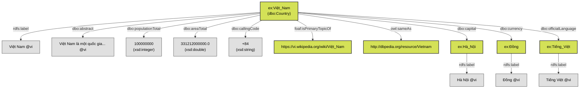

# Ontology and Schema Design

This document outlines the design mindset, rulesets, and analysis used to model the Vietnamese DBpedia Country dataset into a structured RDF Knowledge Graph.

## 1. Basic Analysis

The source data originates from Vietnamese Wikipedia infoboxes. Wikipedia data is notoriously semi-structured and inconsistent. For countries, the data extraction pipeline yields a canonical set of fields:
- **Identifiers:** Page ID, Canonical Title, Source URL, Wikidata ID, English Title.
- **Textual Data:** Abstract (summary paragraph).
- **Quantitative Data:** Population Total, Area (km²).
- **Categorical/Relational Data:** Capital, Currencies, Official Languages, Calling Codes.

In a traditional relational database, we would create a `countries` table with foreign keys to `capitals` and `currencies`. However, to meet the **Semantic Web 4-star/5-star standards**, we must model this as a directed graph where entities are nodes connected by relationship edges (predicates).

## 2. Design Mindset

The design of this ontology is driven by the principles of **Linked Open Data (LOD)**:

1. **Reusability over Invention:** Instead of creating a custom schema (e.g., `vi-schema:population`), we reuse the globally recognized **DBpedia Ontology (`dbo:`)** and standard W3C vocabularies (`rdfs:`, `owl:`, `foaf:`). This ensures that our dataset is instantly interoperable with existing Semantic Web tools and knowledge bases.
2. **Open World Assumption:** In RDF, the absence of a triple does not mean the value is explicitly false; it just means it is unknown. If a country's population could not be parsed, the triple is simply omitted. We do not emit "null" or "N/A" strings.
3. **Things, not Strings:** Wherever possible, categorical values (like languages or capitals) are modeled as distinct URIs (Things) rather than plain text (Strings). This allows the graph to be expanded later (e.g., adding properties to the `ex:Hà_Nội` node).

## 3. Ruleset and Conventions

### 3.1. Namespace and URI Policy
- **Resource Namespace (`ex:`):** `http://vi.dbpedia.org/resource/`
  - Used for all entities. The local name is the URL-encoded Wikipedia title, replacing spaces with underscores (e.g., `http://vi.dbpedia.org/resource/Việt_Nam`).
- **Ontology Namespace (`dbo:`):** `http://dbpedia.org/ontology/`
  - Used for standard classes and properties (e.g., `dbo:Country`, `dbo:capital`).

### 3.2. Class Definitions
Every country record is instantiated as a member of the DBpedia Country class:
- `?country rdf:type dbo:Country`

### 3.3. Property Mapping and Data Typing

| Extracted Field | RDF Predicate | Object Type / Datatype | Rule / Mindset |
| :--- | :--- | :--- | :--- |
| `title_vi` | `rdfs:label` | `Literal (@vi)` | Language tags (`@vi`) are crucial for internationalized data. |
| `abstract_vi` | `dbo:abstract` | `Literal (@vi)` | Same as above; provides human-readable context. |
| `source_url` | `foaf:isPrimaryTopicOf` | `URIRef` | Connects the semantic entity to the human-readable Wikipedia HTML page. |
| `population_total` | `dbo:populationTotal` | `xsd:integer` | Strictly typed as an integer to allow SPARQL mathematical filters (e.g., `FILTER(?pop > 1000)`). |
| `area_km2` | `dbo:areaTotal` | `xsd:double` | Converted from km² to square meters (m²) to align with standard DBpedia unit conventions. |
| `calling_codes` | `dbo:callingCode` | `xsd:string` | Modeled as a string literal since phone codes aren't typically treated as distinct entity nodes. |

### 3.4. Relational Links (Object Properties)

For fields that represent other entities (`capital`, `currencies`, `official_languages`), the pipeline extracts both a display label and an optional Wikipedia internal link target (`wiki_title`).

- **Rule:** If a `wiki_title` is present, emit an **Object Property** linking to a new URI, and attach the label to that new URI.
  ```turtle
  ex:Việt_Nam dbo:capital ex:Hà_Nội .
  ex:Hà_Nội rdfs:label "Hà Nội"@vi .
  ```
- **Fallback:** If no `wiki_title` is present (the text was unlinked in Wikipedia), fallback to a **Datatype Property** (Literal).
  ```turtle
  ex:Some_Country dbo:currency "Unknown Currency"@vi .
  ```

### 3.5. Cross-Lingual Identity (The 5th Star)

To achieve the 5-star Linked Data standard, our local knowledge graph must connect to other graphs in the LOD cloud.
- **Rule:** If the extraction pipeline identifies a corresponding English DBpedia candidate via Wikipedia's strict interlanguage links, we assert identity using `owl:sameAs`.
  ```turtle
  ex:Việt_Nam owl:sameAs <http://dbpedia.org/resource/Vietnam> .
  ```
- **Mindset:** `owl:sameAs` is a strong logical assertion meaning "these two URIs refer to the exact same real-world entity." We only use it because Wikipedia interlanguage links are structural and high-confidence, unlike fuzzy string matching.

## 4. Visualizing the Ontology

The following diagram illustrates how a single country entity (e.g., Việt Nam) and its properties are structured as a graph, distinguishing between URIs (resources) and Literals (strings/numbers).

